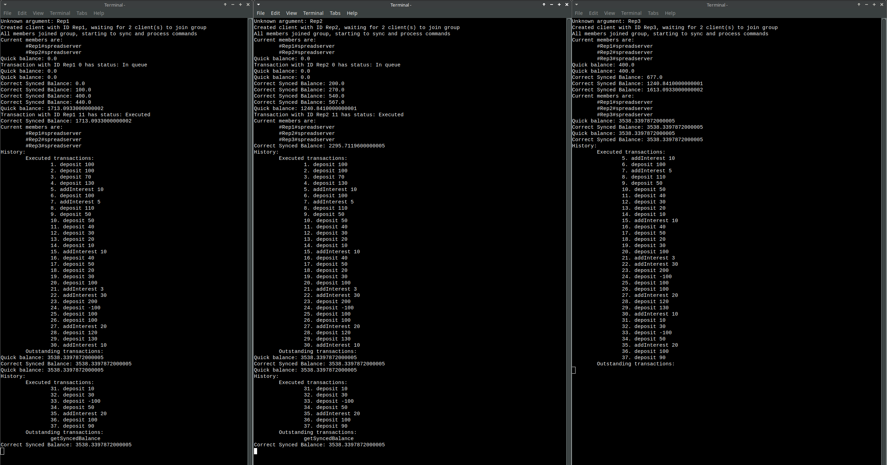

# IN5020 Assignment2 - Replicated Bank Account
This is an assigment in the course Distributed System IN5020 at UIO. 

The project consists of a java program which is the clients, and a spread server which is reponsible for handling multicast between the servers.
The clients all share a consistent view of the balance of a bank account. Each of the clients can execute commands, which includes depositing and adding interest to the account balance. 
The clients will always contain the same balance and execution history, even when a new client joins in the middle of execution.

## Workload distribution

| **Functionality** | **Group Member** |
| ----- | ----- |
|Parsing input (from file and command line) | Anju |
|Spread connection | Henrik |
|Processing of commands | Kevin |
|Sending and updating outstanding_collection and counters | Henrik |
|Membership synchronization | Kevin |
|GetSyncedBalance (Naive and Correct) | Anju |
|Misc. (getQuickBalance, getTxStatus, memberInfo, etc.) | Everyone |

## Requirements
To run the project, you need the following requirements:
- Maven (If you want to compile)
- Java
- Docker

## Starting the spread server

To start the spread server, do the following steps:

1. Modify the [`Spread configuration`](./spread.conf) with the IP adress and port the spread server should run on
2. Run `docker build -t spread-image .` to build a docker image called _spread-image_
3. Run `docker run --rm --name spread -it -p 4803:4803 spread-image` to start a docker container

Now spread should be running and accepting new members.

## Starting the clients
You can either start the clients using the command line, or by running a start script

### Start the client in the command line

To start the clients, do the following steps:

1. Compile the java files using `mvn clean package`
2. Run the following commands for starting the clients:

   - Example command for Windows:
     ```sh
     java -cp "target\assignment2-1.0-SNAPSHOT.jar;lib\spread.jar" com.example.Client --server 127.0.0.1 --account Group10 --file exampleinputfile.txt --replicas 2 --id 1
     ```
   - Example command for Linux/Mac:

     ```sh
     java -cp target/assignment2-1.0-SNAPSHOT.jar:lib/spread.jar com.example.Client --server 127.0.0.1 --account Group10 --file exampleinputfile.txt --replicas 2 --id 1
     ```

### Command-line arguments

`--server <address>`
Specifies the IP adress of the spread server the client should connect to.

`--account <group name> `
Specifies the account group the client will join in the Spread Server.

`--file <file name>`
Input file containing commands to be executed by the client, instead of reading commands directly the command line.

`--replicas <number>`
Specifies the number of replicas (clients) that need to join the group before the client starts processing commands.

`--naive`
If specified, enables the naive synchronization mode for checking balances using getSyncedBalance. In naive mode, the balance is printed once all outstanding transactions have been processed.

`--ìd <client id>`
Manually sets a unique ID for the client. If not provided, a random ID will be generated.

### Using start script
To start a test scnario, run one of the following scripts. If the script does not work, you may need to insert the absolute path in the script.
This will start 3 replicas (Two at first, then one 15 seconds later) using the example input commands `Rep1.txt`, `Rep1.txt`, and `Rep1.txt`.

- For Windows, run the script [`start_script_windows.ps1`](./start_script_windows.ps1)
- For MacOS, run the script [`start_script_mac.sh`](./start_script_mac.sh)
- For Linux with the terminal XFCE4, run the script [`start_script_xfce4.sh`](./start_script_xfce4.sh)

## Theory/Notes

### Results
The results from running the start script is shown in the `Results.png ` image:



### Difference between Naive and Correct getSyncedBalance command

#### Naive implementation

In the naive implementation, the getSyncedBalance command is only executed when the outstanding_collection of transactions is empty. This means that the client waits until all outstanding transactions have been broadcast to all other replicas and applied to the account's state before checking the synchronized balance. This approach is simple but can lead to potential deadlocks if the outstanding_collection never becomes empty, especially when new transactions are continuously added.

#### Correct implementation

In the correct implementation, the getSyncedBalance command itself is treated like a transaction and added to the outstanding_collection. However, there are two key differences:

1. Selective Execution: When the getSyncedBalance transaction is received by other replicas, only the original client that sent the command executes the balance check.
2. Removal Without Execution: Once the getSyncedBalance transaction is processed, it is removed from the outstanding_collection but is not added to the executed_list, ensures that it doesn’t impact future state changes.

### Note for joining clients with already running clients:

When starting a client with other, already running clients, the new client will join and sync with them.
However, if the new client has `num_of_rep` set at the same amount of group members, the new client will think it can start executing and is not a new member.
This will cause the new client to exit as it detects it is not synchronized.
To prevent this simply set `num_of_client` to be **less or more** than amount of member including the new member.

In practice, this means that if you want to join a new client to the others, it should have `num_of_clients` the **same as the ones already running**.